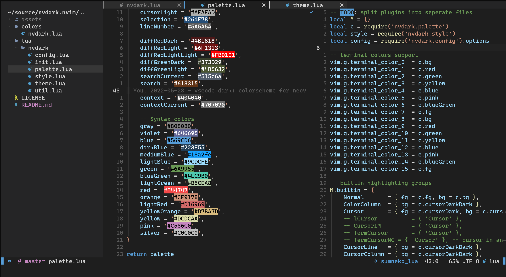
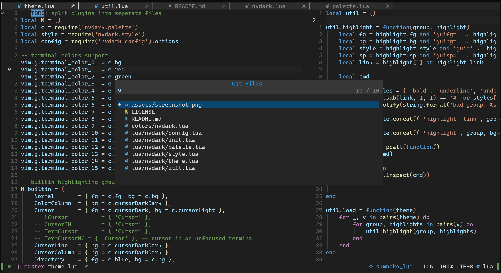

# nvdark.nvim

A Neovim's port of VSCode dark+ colorscheme written in lua.

 

## 🔥Supported plugins

- tree-sitter
- Telescope
- gitsigns.nvim
- nvim-cmp
- NvimTree
- barbar.nvim
- indentBlankLine
- which-key.nvim
- nvim-notify
- nvim-ts-rainbow

## ✅ TODO

- [ ] windline theme
- [ ] BufferLine

## ❤ Credits

- [vim-code-dark](https://github.com/tomasiser/vim-code-dark) 
- [vscode.nvim](https://github.com/Mofiqul/vscode.nvim)

